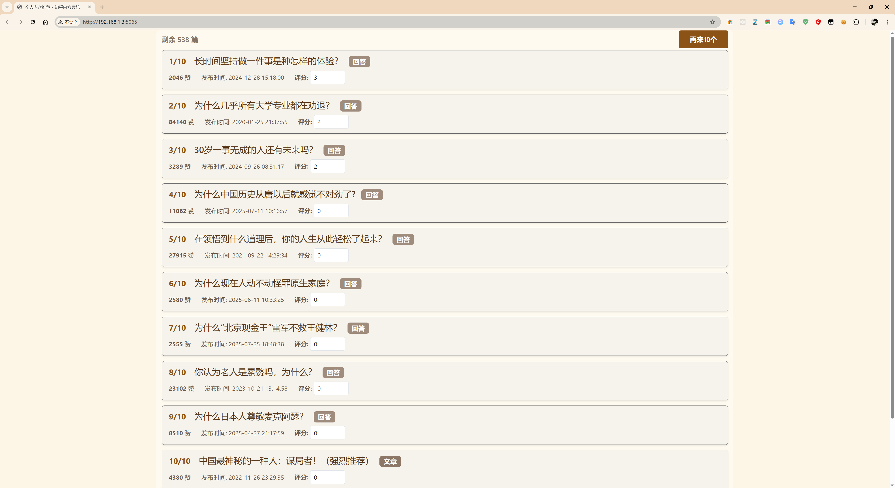

### read_zhihu_app

### 7.30 
继续来做这个项目。 

我的想法是：

1. 爬取数据，已经完成了。
2. 先人工选出一些优质的，高赞的回答。标准是： 赞同数超过2000。
3. 然后推荐给自己。每天阅读10篇，20篇，差不多够了。

### 效果图

### 运行方式

1. pip install -r requirements.txt

2. python app.py

3. 打开浏览器，输入http://localhost:5082/

