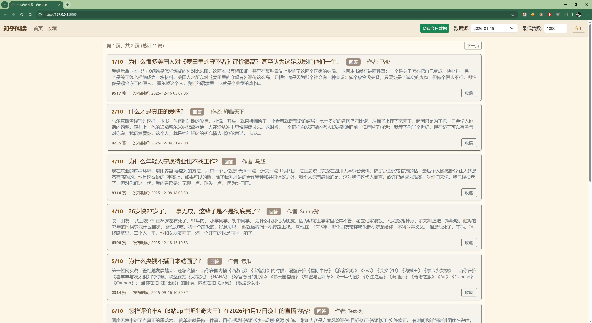

### read_zhihu_app

一个简单的知乎推荐app，自动过滤高质量内容。



## 🚀 快速开始

### 方式一：使用启动脚本（推荐）
```bash
# Windows
启动.bat

# 或直接双击 启动.bat 文件
```

### 方式二：命令行启动
```bash
# 1. 安装依赖
pip install -r requirements.txt

# 2. 启动应用
python app.py

# 3. 打开浏览器访问
http://localhost:5065
```


## 🔧 数据采集

如需采集新数据，使用playwright爬虫：

```bash
cd playwright_zhihu

# 1. 首次使用需要登录
python a1_login.py

# 2. 采集数据
python a2_get_api_data.py
```

采集的数据会保存在 `playwright_zhihu/YYYY-MM-DD/` 目录下。


## 🛠️ 技术栈

- **后端**: Flask (Python)
- **前端**: Bootstrap 5 + Vanilla JS
- **爬虫**: Playwright
- **数据**: JSON文件存储

# 如果有人举报，我就删掉。

